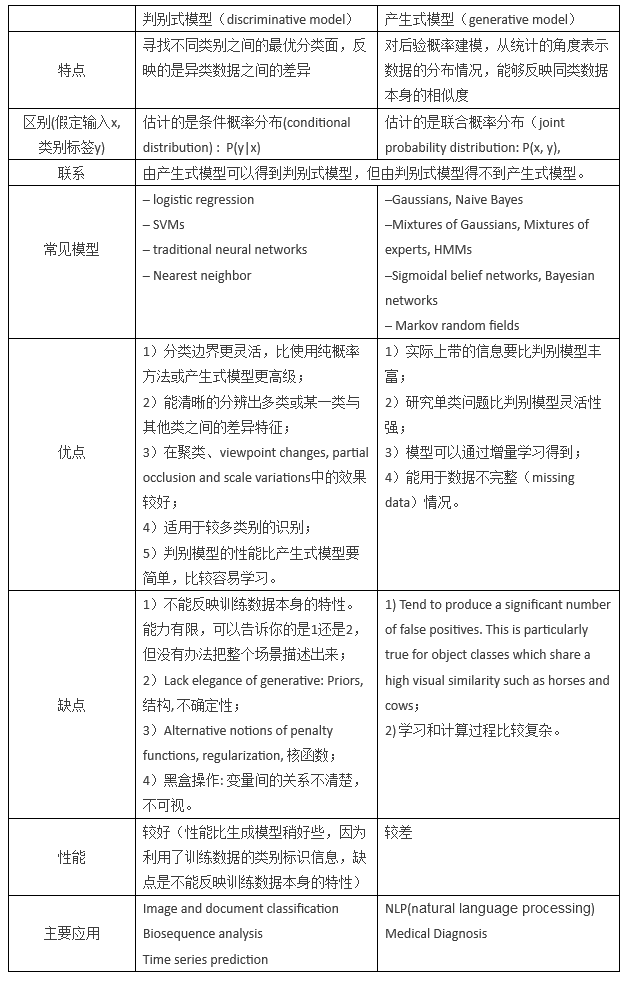

---
export_on_save:
  markdown: true
TOC:
  depthFrom: 2
  depthTo: 3
---

# NOTE

## [一些基本概念](https://blog.csdn.net/nyotengu/article/details/81362025)

## OLTP vs OLAP

@import "./assets/OLTP_OLAP.png"{height=50%}

## 有监督离散化

- [基于熵](https://natmeurer.com/a-simple-guide-to-entropy-based-discretization/)

## [数据立方的两种表:事实表和维度表](https://blog.csdn.net/helloxiaozhe/article/details/90488152)

事实表：外键，来自维度表的主键

维度表：主键

> 用关系型数据库术语描述就是，键属性称为主键列。

## [事实表](https://www.cnblogs.com/xyg-zyx/p/9803580.html)

事实表分成三种：事务事实表、周期快照事实表、累计快照事实表

### 事务事实表

官方定义是：发生在某个时间点上的一个事件。比如以订单为例：下单是一个事实、付款是一个事实、退款是一个事实，所有事实的累计就是事务事实表

### 周期快照事实表

如果需要对某一天或者某个月的数据进行分析，那么可以使用周期快照事实表，比如：以天举例，财务报表一般都是周期快照事实表，它的最细粒度主键就是：日期+订单

### 累计快照事实表

累计快照表，具有确定的开始和结束事件，并且记录关键事件或者过程的里程碑，它因此包含了很多日期的外键

## [判别模型和生成模型](https://zhuanlan.zhihu.com/p/74586507)

从概率分布的角度考虑，对于一堆样本数据，每个均有特征$X_i$对应分类标记$y_i$。

生成模型：学习得到**联合概率分布 P(x,y)=P(x|y)**，即特征 x 和标记 y 共同出现的概率，然后求条件概率分布。能够学习到数据生成的机制。

判别模型：学习得到**条件概率分布 P(y|x)**，即在特征 x 出现的情况下标记 y 出现的概率。

## [贪心有监督和无监督预训练方法](https://blog.csdn.net/zhq9695/article/details/84770385)

## [P NP NPH NPC](https://blog.csdn.net/li1194094543/article/details/104400173)

- P 问题：在多项式时间内“==能解决==”的问题。
  如找 n 个数中的最大数，最小生成树问题等
- NP 问题：在多项式时间内“==能验证==”的问题。
  如可满足性(SAT)问题
- NP-Complete 问题（NP-完全问题）
  所有 NP 问题能在多项式时间内==规约==到该问题;
  且该问题本身==属于 NP ==问题.
- NP-Hard 问题（NP-难问题）
  所有 NP 问题能在多项式时间内==规约==到该问题.

## [泛化误差、偏差、方差，过拟合和欠拟合](https://zhuanlan.zhihu.com/p/38853908)

- 过拟合
  高方差低偏差
- 欠拟合
  低方差高偏差

## KNN Bayes Decision-Tree

- 比较：<https://www.datasciencecentral.com/profiles/blogs/comparing-classifiers-decision-trees-knn-naive-bayes>
- 时空复杂度比较 <https://pub.towardsai.net/time-and-space-complexity-of-machine-learning-models-df9b704e3e9c>

### [KNN](https://zhuanlan.zhihu.com/p/61341071)

### [Bayes](https://zhuanlan.zhihu.com/p/26262151)

Math Form: <https://scikit-learn.org/stable/modules/naive_bayes.html>

### [Decision-Tree](https://zhuanlan.zhihu.com/p/336122284)

信息增益：<https://www.numpyninja.com/post/what-is-entropy-and-information-gain-how-are-they-used-to-construct-decision-trees>

裁剪：
@import "./assets/cut.png"

## 知识发现的主要过程

- 数据清洗
- 数据集成
- 数据选择
- 数据变换
- 数据挖掘
- 模式评估
- 知识表示

## 评估分类器准确率的方法

## 正则化技术

## [关联规则——Apriori](https://blog.csdn.net/weixin_41677876/article/details/106349839)

关联规则的概念最早是在 Agrawal 等人在 1993 年发表的论文 Miniing association rules between sets of items in large databases 中提出。关联规则挖掘（关联分析）用于发现隐藏在大型数据集中的联系或者规律。如今随着数据行业的快速发展，我们面对的数据规模愈发巨大，人们对于挖掘海量数据中隐含的关联知识也越来越感兴趣。

### 计算概念

#### 支持度 support

也就是 A 和 B 同时发生的概率
$support(X\rArr Y)=\frac{N(X\cap Y)}{N}$

该指标作为建立强关联规则的第一个门槛，通过最小阈值(minsup)的设定，来剔除那些 “出镜率” 较低的无意义的规则:
$support(Z)\ge minsup$

#### 置信度 Confidence

A 发生时 B 发生的概率(条件概率)
$confidence(X\rArr Y)=P(Y|X)$
也要对置信度设置 最小阈值(mincon) 来进一步筛选满足需要的强关联规则。因此，继产生频繁项集后，需从中进而选取满足：
$confidience(X\rArr Y)\ge mincon$

#### 提升度 Lift

置信度与支持度的比值
$Lift(X \rArr Y)=\frac{confidience(X\rArr Y)}{support(X\rArr Y)}$

@import "./assets/Sup&Conf.png"

### [算法流程与实例](https://blog.csdn.net/qq_41230076/article/details/106094841)

## [改进-基于频繁模式树的算法 FP](https://blog.csdn.net/wsp_1138886114/article/details/80921905?utm_source=app)

## [信息增益的计算](https://zhuanlan.zhihu.com/p/136100996)

[详细实例](https://blog.csdn.net/qq_45997545/article/details/109752960)

## [k-means](https://www.cnblogs.com/gaochundong/p/kmeans_clustering.html) k-cluster [k-center](https://blog.csdn.net/qq_34330491/article/details/106053847)

- k-means:
  minimizing the sum of squares of distances between data and the corresponding cluster centroid.
- k-cluster
  better k-center: 随机选一个点作为集合 S，然后逐步选择与 S 最大的点，选出 k 个进行分配
- k-center
  寻找 k 个半径越小越好的 center 以覆盖所有的点。(greedy)

## 朴素贝叶斯分类计算

见上

## [K-means 计算实例](https://blog.csdn.net/A496608119/article/details/115225919)

## [凝聚层次聚类法（全链接与单链接）](https://blog.csdn.net/weixin_45488228/article/details/102493562)

## PageRank——马尔可夫矩阵的特征向量

### PageRankRef

- <https://zhuanlan.zhihu.com/p/137561088>
- <https://blog.csdn.net/sdgihshdv/article/details/77340966>

### PageRankFormula

- 对于图$G=(V,E)$,一条有向边$(i, j)\in E$当且仅当网页$i$指向网页$j$，$n$为总的网页数。 网页$i$的$P(i)$定义为
  $P(i)=\sum_j^n\frac{P(j)}{Out_i}$
- 马尔可夫矩阵$M$表示
  $P_k=MP_{k-1}=......=M^kP_0$
- [修正式](https://blog.csdn.net/sdgihshdv/article/details/77340966)

### PageRank 优缺点

- 防欺骗
  网页所有者难以设置其它重要网页指向他自己的网页.
- PageRank 值独立于查询，是一种全局度量.
  PageRank 值是通过所有网页计算得到并加以存储，而不是提交查询时才计算.
- 缺点：
  不能区分全局重要性网页和查询主题重要性网页.

## Hits——$L^TL$与$LL^T$的特征向量

> L 邻接矩阵

### HitsRef

<https://blog.csdn.net/hguisu/article/details/8013489>

### HitsFormula

- 分量方程计算
  @import "./assets/hits.png"
- 矩阵计算（直到收敛）
  $A^{authority}_k = L^TLA^{authority}_{k-1}$
  $H^{hub}_k = LL^TH^{hub}_{k-1}$

### Hits 优缺点

- 根据查询进行排序，可能会返回更相关的权威性和汇集性网页
- 缺点：
  - 容易被欺骗. 一个网站开发者很容易在自己的网页中加入许多出边.
  - 主题漂移（Topic drift）. 许多扩展网页可能与主题并不相关.
  - 查询效率: 动态抓取网页进行扩展、特征值计算

## [神经网络的正反向传播计算（sigmoid、ReLU、softmax 激活函数）](https://blog.csdn.net/wangqianqianya/article/details/82961276)

## [损失函数与极大似然](./assets/DM2021.pdf)

@import "./assets/likehood.pdf"

## 复习资料

@import "./assets/DM2021.pdf"
